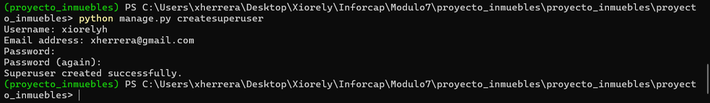
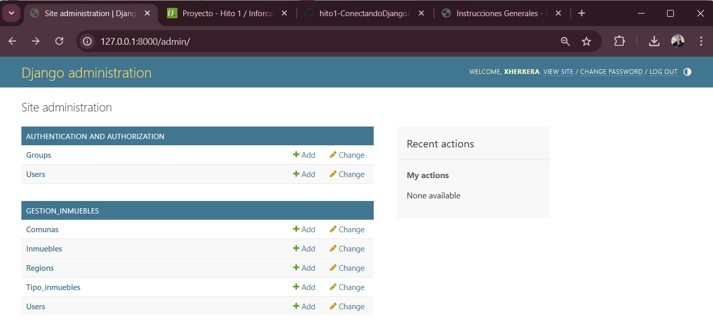
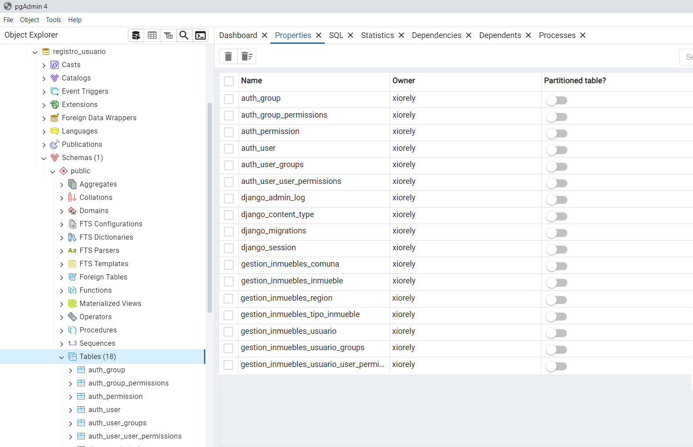
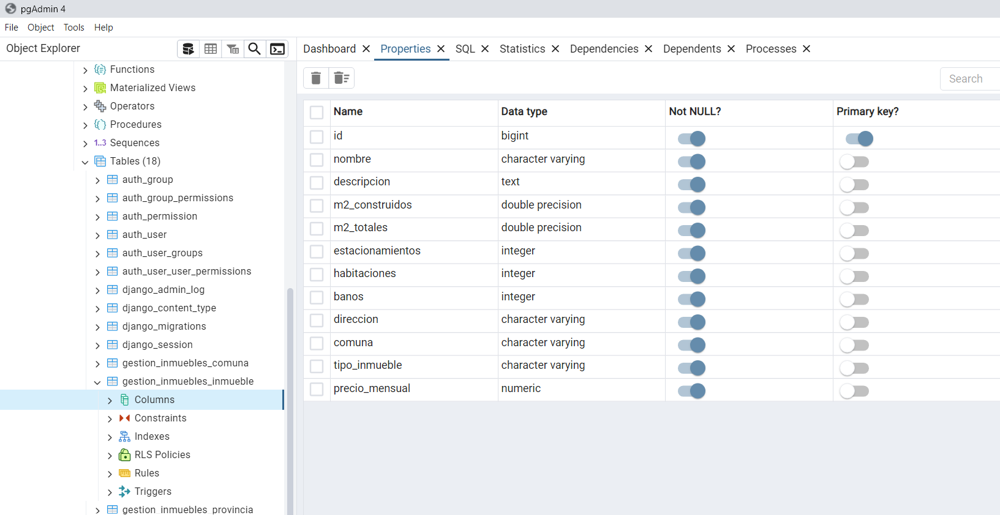
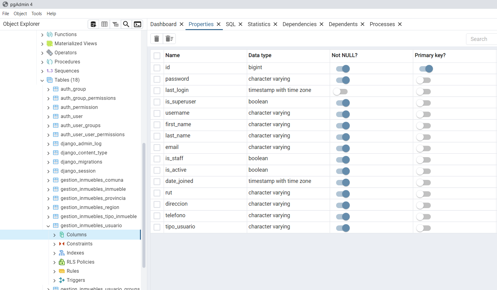
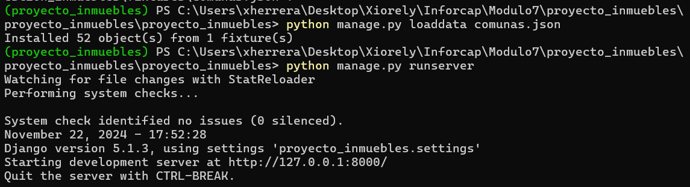
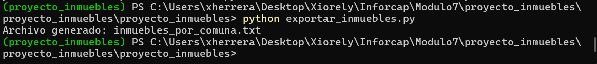
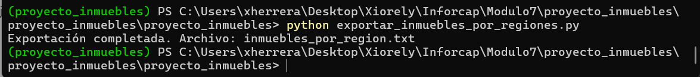
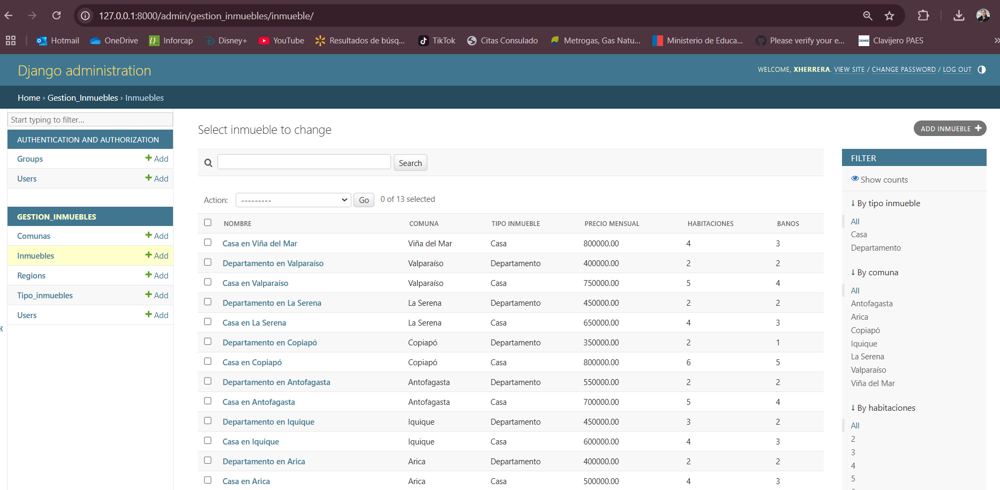
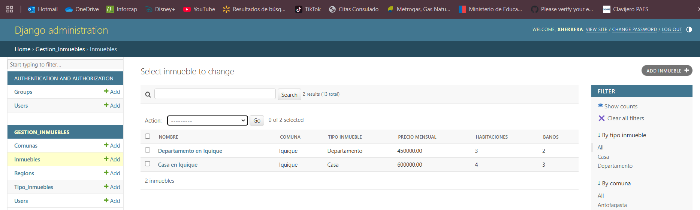

# Proyecto Inmuebles 🏡

Aplicación web desarrollada en **Django** para la gestión de inmuebles y usuarios.

## Requisitos 🛠️

Antes de comenzar, asegúrate de tener instalado lo siguiente:

- Python 3.10 o superior
- Django 4.x
- PostgreSQL 
- pip para gestionar dependencias

## Modelos principales 📦
- Usuario: Basado en AbstractUser, incluye atributos como rut, direccion, telefono, y tipo_usuario.
- Inmueble: Detalles como nombre, m2_construido, m2_terreno, precio, tipo_inmueble y más.
- Región, Provincia y Comuna: Organización geográfica para inmuebles.
- Tipo de Propiedad: Clasificación de inmuebles.

## Contribuir 🤝

- Si deseas contribuir: Haz un fork del proyecto.

## Screenshots

Hito 2

Hito 3

## Autor

- [Xiorely Herrera](https://github.com/Xiorelyh)

